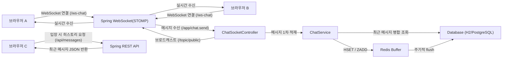
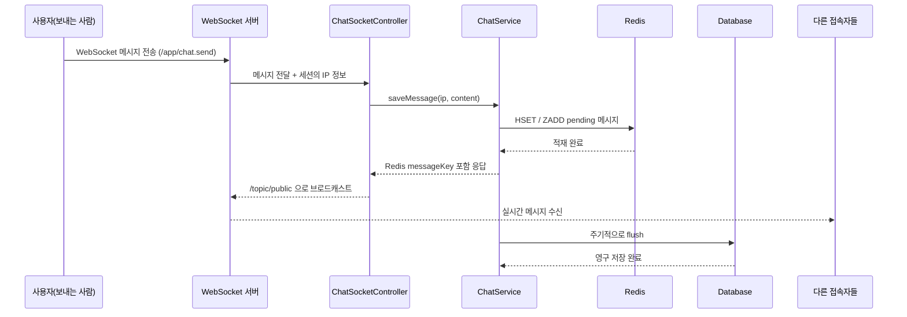

# spring-ip-chat

로그인 없이 접속자의 IP를 ID처럼 사용해서 대화하는 공개 채팅방입니다.

## 기능
- Spring WebSocket(STOMP + SockJS) 실시간 채팅
- 로그인 없음, 발신자 식별자는 서버가 추출한 클라이언트 IP
- Redis 1차 적재 후 PostgreSQL 최종 저장
- 늦게 들어온 사용자도 기존 히스토리 조회 가능
- 오래된 메시지 자동 정리(retention, 기본 30일)
- 본인 메시지 삭제(IP 기준)
- 기본 HTML UI (CSS 최소)

## 기술 스택
- Java 17
- Spring Boot 3
- Spring WebSocket
- Spring Data Redis
- Spring Data JPA
- H2 (로컬 기본)
- Redis (버퍼/큐)
- PostgreSQL (배포용)

## 동작 원리 (아키텍처)


## 메시지 흐름 (시퀀스)


## WebSocket의 역할
- 로그인 없이 접속한 사용자들이 실시간으로 메시지를 주고받게 합니다.
- 클라이언트가 `/app/chat.send`로 보낸 메시지를 서버가 받아 처리하게 합니다.
- Redis에 적재된 메시지를 `/topic/public`으로 모든 접속자에게 즉시 브로드캐스트합니다.
- 즉, "지금 접속 중인 사람들"의 실시간 전달을 담당합니다.

## Redis의 역할
- 새 메시지를 가장 먼저 받아서 짧은 지연으로 적재합니다.
- `pending` 메시지 목록을 들고 있다가 스케줄러가 주기적으로 DB로 flush합니다.
- DB flush 전에도 최근 히스토리 조회 시 Redis pending 메시지를 함께 합쳐 보여줍니다.
- 즉, "실시간 입력 버퍼와 최종 DB 적재 전 임시 저장소" 역할입니다.

## DB의 역할
- Redis에서 내려온 메시지를 `chat_messages` 테이블에 영구 저장합니다.
- 새로 들어온 사용자가 `GET /api/messages`로 과거 대화를 불러올 수 있게 합니다.
- 서버 재시작 이후에도 히스토리를 유지합니다(특히 PostgreSQL 사용 시).
- 즉, "과거 대화 기록 보존과 조회"를 담당합니다.

## 로컬 실행
```bash
cd spring-ip-chat
./mvnw spring-boot:run
```

`mvnw`가 없으면:
```bash
mvn spring-boot:run
```

실행 후 접속:
- [http://localhost:8080](http://localhost:8080)

## 주요 API
- `GET /api/me`: 서버 기준 내 IP 확인
- `GET /api/messages?limit=200`: 최근 채팅 히스토리 조회
- WebSocket Endpoint: `/ws-chat`
- Send Destination: `/app/chat.send`
- Subscribe Topic: `/topic/public`

## DB 설정
기본은 로컬 파일 H2를 사용합니다.

환경변수 설정 시 PostgreSQL로 동작합니다.
- `DATABASE_URL`
- `DATABASE_USERNAME`
- `DATABASE_PASSWORD`
- `CHAT_REDIS_ENABLED`
- `REDIS_HOST`
- `REDIS_PORT`
- `CHAT_RETENTION_DAYS` (기본 `30`, `0` 이하로 두면 자동 삭제 비활성화)

예시:
```bash
export DATABASE_URL=jdbc:postgresql://localhost:5432/chat
export DATABASE_USERNAME=chat
export DATABASE_PASSWORD=chat
mvn spring-boot:run
```

## Render 배포(무료 플랜 기준)
1. GitHub에 이 프로젝트를 푸시
2. Render에서 새 `Blueprint` 생성 후 저장소 연결 (`render.yaml` 자동 인식)
3. Web Service 생성 후 환경변수 추가
4. 배포 완료 후 제공 URL 접속

배포 시 환경변수:
```bash
DATABASE_URL=jdbc:postgresql://<HOST>:<PORT>/<DB>?sslmode=require
DATABASE_USERNAME=<USER>
DATABASE_PASSWORD=<PASSWORD>
```

자세한 무료 배포 절차:
- [`DEPLOY_FREE_KR.md`](./DEPLOY_FREE_KR.md)

## 상시가동(24시간) 배포
슬립 없는 24시간 상시가동이 필요하면 VM 방식으로 운영하세요.

- [`DEPLOY_ALWAYS_ON_KR.md`](./DEPLOY_ALWAYS_ON_KR.md)
- [`docker-compose.always-on.yml`](./docker-compose.always-on.yml)
