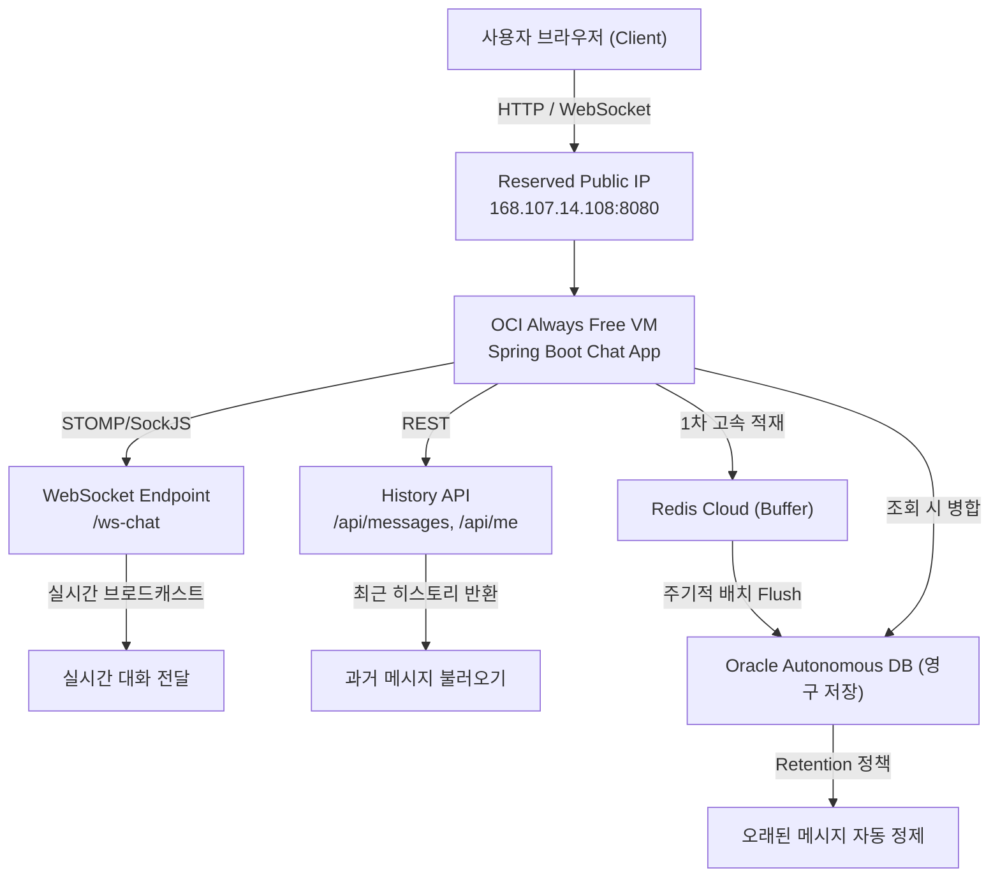
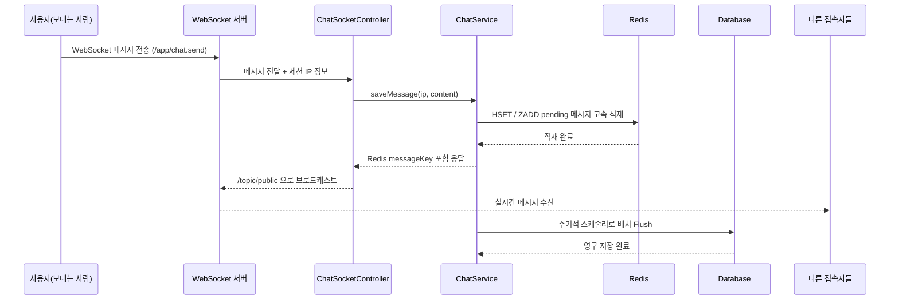

# 💬 Spring IP Chat (공개 IP 기반 실시간 익명 채팅방)

[](http://168.107.14.108:8080/)
[](LICENSE)
[](https://spring.io/projects/spring-boot)
[](https://www.oracle.com/java/)
[](https://redis.io/)
[](https://www.oracle.com/database/)

> **별도의 회원가입이나 로그인 없이 접속자의 공인 IP를 발신자 ID로 사용하여 즉시 실시간 대화를 나누는 익명 웹소켓 채팅 애플리케이션입니다.**  
> Spring Boot 3 + STOMP WebSocket 기반으로 동작하며, Redis Cloud 1차 버퍼링과 Oracle Autonomous DB / PostgreSQL 2차 영구 적재 구조로 설계되어 24시간 상시 가동 환경에서도 지연 없는 실시간 브로드캐스팅 및 히스토리 조회를 제공합니다.

---

## 🔗 주요 링크 및 라이브 데모

- **실제 상시 배포 서버**: [http://168.107.14.108:8080/](http://168.107.14.108:8080/) (OCI Always Free VM)
- **GitHub 저장소**: [minwoo19930301/spring-ip-chat](https://github.com/minwoo19930301/spring-ip-chat)

---

## 🏗️ 운영 아키텍처 한눈에 보기


```mermaid
flowchart TB
    User["사용자 브라우저 (Client)"] -->|"HTTP / WebSocket"| Public["Reserved Public IP<br/>168.107.14.108:8080"]
    Public --> VM["OCI Always Free VM<br/>Spring Boot Chat App"]

    VM -->|"STOMP/SockJS"| WS["WebSocket Endpoint<br/>/ws-chat"]
    VM -->|"REST"| API["History API<br/>/api/messages, /api/me"]

    WS -->|"실시간 브로드캐스트"| Live["실시간 대화 전달"]
    API -->|"최근 히스토리 반환"| History["과거 메시지 불러오기"]

    VM -->|"1차 고속 적재"| Redis["Redis Cloud (Buffer)"]
    Redis -->|"주기적 배치 Flush"| Oracle["Oracle Autonomous DB (영구 저장)"]
    VM -->|"조회 시 병합"| Oracle

    Oracle -->|"Retention 정책"| Cleanup["오래된 메시지 자동 정제"]
```

### ⚙️ 역할 분리 (Layer Responsibilities)
* **WebSocket (`STOMP / SockJS`)**: 현재 접속 중인 모든 사용자에게 메시지를 sub-millisecond 단위로 실시간 브로드캐스팅.
* **Redis (`1차 버퍼`)**: 메시지 수신 직후 고속 적재 및 메모리 버퍼링, DB 배치 Flush 이전에도 병합 조회 지원.
* **Oracle Autonomous DB (`2차 영구 저장`)**: 메시지 영구 저장 및 재접속 사용자를 위한 과거 히스토리 제공.
* **OCI Compute VM (`Standard.E2.1.Micro`)**: Docker 컨테이너 단일 런타임 24시간 무중단 운영.

---

## ✨ 핵심 기능

1. **로그인 없는 익명 IP 식별**:
   * 서버가 웹소켓 세션 및 HTTP 요청 헤더에서 클라이언트의 실재 공인 IP를 자동 추출하여 닉네임 대신 식별자로 활용.
2. **Spring WebSocket + STOMP 실시간 소통**:
   * SockJS 폴백 지원으로 브라우저 호환성을 극대화하고, `/topic/public` 채널을 통해 실시간 메시지 전송.
3. **Redis & DB 2단계 하이브리드 저장소**:
   * 메시지 입력 직후 Redis 1차 버퍼링 ➔ 주기적 스케줄러를 통한 DB 2차 영구 적재.
4. **대화 히스토리 및 본인 메시지 관리**:
   * 신규 접속자도 이전 대화 히스토리(`GET /api/messages`) 자동 조회.
   * 본인 IP 기준 메시지 삭제 기능 지원.
5. **오래된 메시지 자동 정제 (Retention)**:
   * 설정된 보관 기간(기본 30일)이 지난 메시지는 배치 작업으로 자동 뷰 정제.
6. **관측성 (Observability & Actuator)**:
   * Prometheus 메트릭 수집(`/actuator/prometheus`) 및 Liveness/Readiness 헬스 체크 엔드포인트 분리 제공.

---

## 🛠️ 기술 스택 (Tech Stack)

| 구분 | 기술 스택 |
| :--- | :--- |
| **Language & Framework** | Java 17, Spring Boot 3.3.9, Spring WebSocket |
| **Messaging Protocol** | STOMP, SockJS |
| **Database & Caching** | Redis Cloud, Oracle Autonomous DB, PostgreSQL, H2 (로컬) |
| **Observability** | Spring Boot Actuator, Micrometer Prometheus |
| **Deployment & Infra** | Docker, Docker Compose, OCI (Oracle Cloud Infrastructure) Always Free |

---

## 🔄 메시지 흐름 시퀀스 (Sequence Diagram)


```mermaid
sequenceDiagram
    participant Sender as 사용자(보내는 사람)
    participant WS as WebSocket 서버
    participant C as ChatSocketController
    participant S as ChatService
    participant R as Redis
    participant DB as Database
    participant Others as 다른 접속자들

    Sender->>WS: WebSocket 메시지 전송 (/app/chat.send)
    WS->>C: 메시지 전달 + 세션 IP 정보
    C->>S: saveMessage(ip, content)
    S->>R: HSET / ZADD pending 메시지 고속 적재
    R-->>S: 적재 완료
    S-->>C: Redis messageKey 포함 응답
    C-->>WS: /topic/public 으로 브로드캐스트
    WS-->>Others: 실시간 메시지 수신
    S->>DB: 주기적 스케줄러로 배치 Flush
    DB-->>S: 영구 저장 완료
```

---

## 💻 로컬 개발 환경 실행

```bash
# 저장소 클론
git clone https://github.com/minwoo19930301/spring-ip-chat.git
cd spring-ip-chat

# Maven Wrapper로 바로 실행 (로컬 H2 DB 기본 동작)
./mvnw spring-boot:run
```

실행 후 브라우저에서 **[http://localhost:8080](http://localhost:8080)** 접속.

---

## 📡 주요 REST API & WebSocket 엔드포인트

| 방식 | 엔드포인트 | 설명 |
| :--- | :--- | :--- |
| `GET` | `/api/me` | 서버 기준 본인의 공인 IP 확인 |
| `GET` | `/api/messages?limit=200` | 최근 채팅 과거 히스토리 조회 |
| `WS` | `/ws-chat` | WebSocket 연결 핸드쉐이크 엔드포인트 |
| `SEND` | `/app/chat.send` | 메시지 발신 주소 |
| `SUB` | `/topic/public` | 메시지 실시간 수신 구독 채널 |

---

## 🚀 배포 가이드

- 🟢 **상시가동 (24시간 무중단 OCI VM 배포)**: [`DEPLOY_ALWAYS_ON_KR.md`](./DEPLOY_ALWAYS_ON_KR.md) 참조
- 🔵 **무료 클라우드 (Render / PaaS 배포)**: [`DEPLOY_FREE_KR.md`](./DEPLOY_FREE_KR.md) 참조

---

## 📄 라이선스 (License)

본 프로젝트는 **[MIT License](LICENSE)**에 따라 자유롭게 이용, 수정 및 재배포할 수 있습니다.
